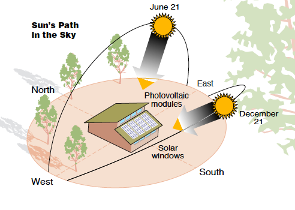

## References
- [Thí nghiệm Sự mọc và lặn của Mặt Trời](https://www.youtube.com/watch?v=BXioUr_GAeg)
- [Tại sao Mặt Trời MỌC và LẶN](https://www.youtube.com/watch?v=cUbeSoii080)

> Khi Bắc bán cầu đang trải qua mùa hè, Nam bán cầu sẽ đang trải qua mùa đông. Điều này xảy ra do sự nghiêng của trục Trái Đất: khi Bắc bán cầu hướng về phía Mặt Trời, nhận được nhiều ánh sáng và nhiệt hơn, Nam bán cầu lại hướng xa hơn khỏi Mặt Trời, nhận ít ánh sáng và nhiệt hơn, dẫn đến thời tiết lạnh hơn và ngày ngắn hơn.

> Khi Việt Nam và các nước khác ở Bắc bán cầu đang trải qua mùa hè, các nước ở Nam bán cầu như Úc, Nam Phi, và Argentina đang trải qua mùa đông. Mùa đông ở Nam bán cầu thường bắt đầu từ tháng 6 và kéo dài đến tháng 8 hoặc tháng 9. Trong thời gian này, những nước này sẽ có thời tiết lạnh hơn, ngày ngắn hơn và tùy thuộc vào địa hình cũng có thể có tuyết rơi ở những khu vực cao lạnh hơn.

----
----

> Đặc trưng khi nằm trong bắc bán cầu chính là mùa đông ánh sáng mặt trời chiếu vào cửa số hướng Nam nên dễ hấp thu lượng nhiệt tỏa ra từ ánh sáng mặt trời để sưởi ấm căn nhà.

Bạn hoàn toàn đúng, Mặt Trời luôn mọc ở phía đông và lặn ở phía tây. Tuy nhiên, điểm mọc và lặn của Mặt Trời không cố định mà thay đổi theo các mùa trong năm. Đối với những người sống ở Bắc bán cầu:

- **Mùa đông**: Mặt Trời mọc và lặn nghiêng về phía đông nam và tây nam, tạo ra một quỹ đạo thấp trên bầu trời và chiếu nghiêng từ phía nam vào các cửa sổ hướng nam. Điều này cho phép ánh sáng mặt trời chiếu sâu vào bên trong nhà, giúp hấp thụ nhiệt vào mùa lạnh.

- **Mùa hè**: Mặt Trời mọc và lặn nghiêng về phía đông bắc và tây bắc, di chuyển cao hơn trên bầu trời, qua đỉnh đầu, giảm bớt sự chiếu sáng trực tiếp vào cửa sổ hướng nam so với mùa đông, giúp giảm nhiệt lượng vào nhà và giữ cho nhà mát mẻ hơn.

Nhờ sự thay đổi này, việc hướng cửa sổ về phía nam ở Bắc bán cầu giúp tận dụng tối đa ánh sáng và nhiệt từ Mặt Trời trong mùa đông, đồng thời hạn chế sự nóng lên trong mùa hè.
